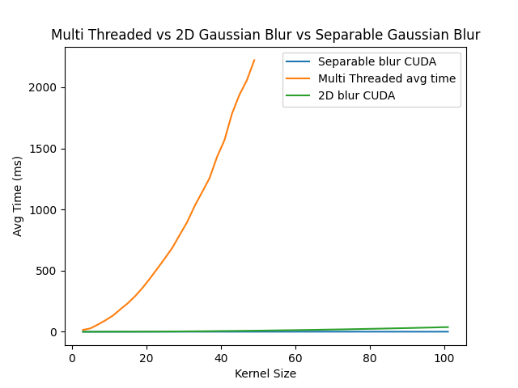

# Report

## Abstract

Gaussian Blurring has numerous applications in various fields, including gaming,
photography, video processing, and medical imaging, to name a few. Here are
some examples of how Gaussian Blurring is used in different areas:

Gaming: Gaussian Blurring is used in gaming to create realistic depth-of-field
effects, which can simulate the way our eyes focus on objects in the real
world. For example, in a first-person shooter game, blurring the background can
make the player feel like they are focusing on a distant object. Another
example is motion blur, which can simulate the way objects appear blurry when
they are moving quickly.

Photography: Gaussian Blurring is commonly used in photography to remove noise
from images and to create soft-focus effects. It can also be used to smooth out
skin tones in portraits and to create a bokeh effect, where the background of
an image appears out of focus.

Video processing: Gaussian Blurring is used in video processing to remove noise
and to smooth out video frames. It is also used to create special effects, such
as blurring out a face in a video to protect someone's identity.

Medical imaging: Gaussian Blurring is used in medical imaging to remove noise
from images and to enhance the contrast between different structures in the
image. For example, it can be used to enhance the edges of a tumor in a CT scan
or MRI image.

However the time complexity \f$(O(nmk^2))\f$ of a naive implementation of
Gaussian Blurring can be quite high, which can result in slow performance. This
is because the process of blurring an image involves convolving the image with
a Gaussian kernel, which requires performing a large number of calculations for
each pixel in the image. Furthermore, the naive implementation requires applying
the kernel to each pixel in the image, which can result in redundant
calculations. This can lead to further slow-downs in performance, especially
for larger images.

This project compares Gaussian Blurring implemented in both CPU and GPU
architectures, and demonstrates the speed benefits of a separable 1D kernel
versus a 2D kernel. Time complexity and performance measurements are used to
analyse the differences between the two kernels on both the CPU and the GPU.
Results show that a separable 1D kernel is faster than a 2D, and this proves
that the speed benefits associated with a separable 1D kernel in image
processing tasks extend across different hardware implementations.

## Dataset

This project uses the standard dataset for image proessing, sourced from [here](https://github.com/mohammadimtiazz/standard-test-images-for-Image-Processing).
The dataset consists of 24 images, which include grayscale, 256 bit color and 512 bit color of each unique image.

## Technologies Used -

1. OpenCV - For reading and writing images
2. OpenMP - For parallelizing the CPU implementation
3. CUDA - For parallelizing the GPU implementation

## Methodology

### CPU -

1. The 2D kernel is first generated and then applied onto the image as a convolution.
2. For parallelizing the CPU implementation, OpenMP `#pragma parallel for` compiler directive is used along with shared data to speed up.
   The separable kernel was not implemented for the CPU because, regardless of the implementation, the process is very slow as compared to GPU

### GPU -

#### 2D Kernel -

1. First the kernel is generated on the host (CPU).
2. Then the image is loaded on the host.
3. The image is then copied to the device (GPU) using OpenCV API.
4. The kernel is copied to the device using `cudaMemcpy()`.
5. An output image is created on the GPU with the help of OpenCV API.
6. The blocks and grids are created, and the Convolution kernel is called with
   the required parameters.
7. Synchronization of GPU threads takes place to ensure no race conditions
   during stress testing.
8. The output image is copied back to the host (CPU) using OpenCV API.
9. The GPU memory is freed using `cudaFree()` and the images are freed using
   OpenCV API.

#### Separable Kernel (1D) -

1. First a 1D kernel is generated on the host (CPU).
2. The image is loaded on the host and then uploaded to the device (GPU).
3. an outpuit image is created on the GPU with the help of OpenCV API.
4. first a convolution is applied along the horizontal axis (x-axis) on the
   original image. This output is stored in a temporary image.
5. Now a convolution is applied along the vertical axis (y-axis) on the
   temporary image. This output is stored in the final output image.
6. The final output image is downloaded to the host.
7. The GPU memory is freed using `cudaFree()` and the images are freed using
   OpenCV API.

## Results -

### Plots -

#### CPU -

**Comparing Single Threaded vs Multi Threaded**

Average Speedup: 7.31 times

#### GPU -

**Separable Kernel** -

**Comparing 2D Kernel vs Separable Kernel -**

Average Speedup : 25.72 times

**Comparing CPU vs GPU implementations -**

Average Speedup : 2461.73 times

## Inference

Gaussian Blurring is a popular technique used in image processing to remove
noise and smooth an image. In this project, the technique is implemented using
both CPU and GPU computing.

The CPU implementation first applies a 2D blur to the image, which is a
computationally intensive task that involves convolving the image with a
Gaussian kernel. This is done using a nested loop structure that applies the
kernel to each pixel in the image.

To improve the performance of the CPU implementation, a multithreaded version
using OpenMP is also implemented. This allows the kernel to be applied to
multiple pixels simultaneously, reducing the total time taken to blur the
image.

The GPU implementation uses CUDA to accelerate the Gaussian blurring process.
The image is transferred to the GPU, and the kernel is applied to each pixel in
parallel using a grid of threads. This greatly reduces the time taken to blur
the image compared to the CPU implementation.

Finally, a separable kernel is used to further improve the performance of the
GPU implementation. This involves breaking the Gaussian kernel into two 1D
kernels, which can be applied separately in the x and y directions. This
greatly reduces the number of computations required to apply the kernel,
resulting in very high speedups.

In summary, Gaussian Blurring using CPU and GPU is a computationally intensive
task that can benefit greatly from parallel processing. By implementing a
multithreaded version using OpenMP and a GPU version using CUDA, the
performance of the algorithm can be greatly improved. Using a separable kernel
further improves the performance of the GPU implementation, resulting in very
high speedups.
